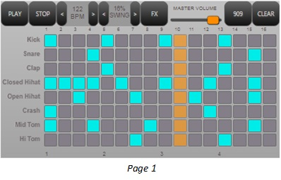
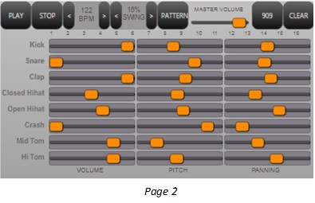
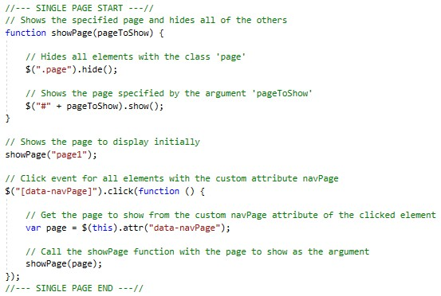
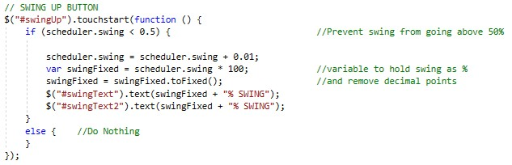
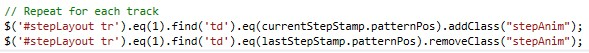
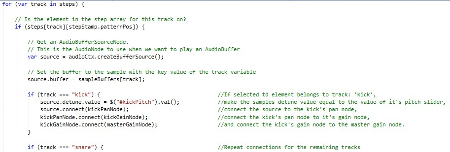

# Quick Step App

### Design
\
  Quick Step is an 8 channel, 16 step pattern sequencer with step number indicators on the main page and further slider controls for the individual track’s amplitude, pitch and panning on the secondary page. The user adds sample hits to the sequencer by tapping pads on the matrix which turns blue in the on position. The user is also shown the current playback position with an orange bar that cycles through the pattern as the scheduler plays. A transport bar remains across the top of the window on both pages, so that the essential controls are always available. These controls are a ‘play/pause’ button, a stop button, global tempo and swing controls, master volume, and a button for clearing the step sequencer. This bar also contains a button for switching between the two pages. The pages are both loaded within the same html file and the app updates dynamically to display the selected page, thus avoiding a delay in the `device ready` event. The design of the app is fully responsive, ensuring that all elements keep their relative sizing regardless of the device’s screen size and resolution.

 

  The app’s samples are included in the solution and are loaded into their sample buffers on opening. As samples are queued in the scheduler, each track has a detune value applied to it according to the position of the corresponding detune slider on the controls page, that can be between one semi-tone above and below its original pitch. Each track is then connected to a panner node which is in turn connected to a gain node connecting to the master gain node. The panner nodes apply a value between -1 (hard left) and 1 (hard right) and these values, along with the value that each signal is multiplied by at the gain nodes, are set by the user using the sliders on the controls page.
  
### Implementation
\
	The application window was split into multiple divs for the general layout, with each div using the `.wrapper` class to keep the contents in proportion, and the aspect ratio as a percentage was added to the `surface` div that contains the whole app. Sizes of all divs and elements were also set as either percentages of their containers or using the relative `vh` and `em` units. The single page functionality was implemented by adding each page in a separate container div with the `.page` class and giving both page switch buttons the `data-navPage` attribute. A click event handler for this attribute is then added that hides both pages with jQuery’s `hide` method and then uses the `show` method to show only the selected page. 
  

  Although the transport bar remains the same when switching, the buttons and displays are separate for each page. For this reason, 2 event handlers are needed, with each one updating the display on the other page as well as performing the button’s function. An example of this is shown below:
   

  The `animateStep` function, which creates the step visualisation, adds the `stepAnim` class to all `td` table elements that match the current step stamp and simultaneously removes the class from the previous step, making whichever step that is playing change colour.
 
 
 
  Similarly, the `touchstart` event handler for the clear buttons removes the `stepOn` class, which turns steps blue to indicate that they are turned on, from every table element in the sequencer’s `stepLayout` div and also loops through every step in the pattern for each sample channel, setting each step’s boolean value to false to stop sample playback.

  The 8 samples are loaded from a key/value array and a new key/value list is created containing an array of steps for each sample channel which are all set to their off positions initially. In the `onQueue` event handler, all of the channels use the same variable `source` and this variable is loaded with a sample when the scheduler reaches a step in the `on` state. A series of `if` statements then sends the sample to be played back through its own processing path where `source.detune.value` is used to change the samples pitch before it is connected through its pan node and gain node. Through moving various sliders, the user changes the detune value, panning position and the gain multiplication of each channel before they are all routed to the master gain node and then the audio output destination. 	

